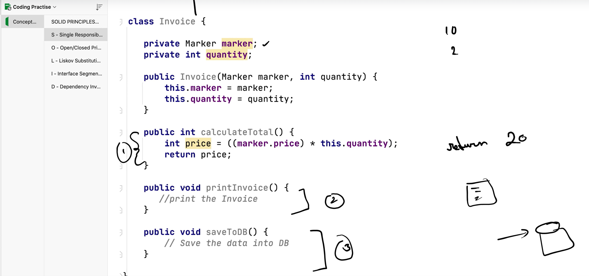
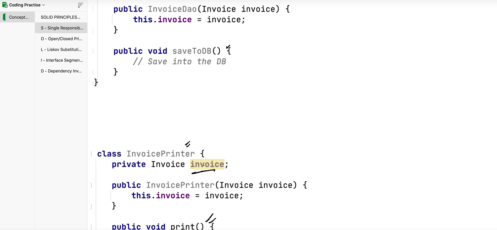
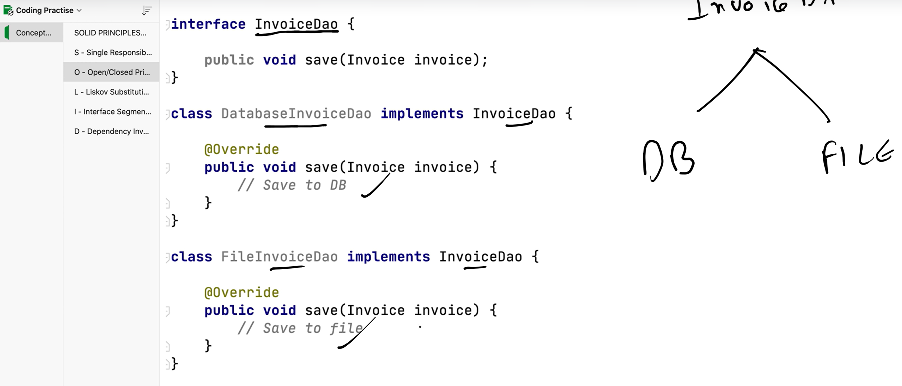
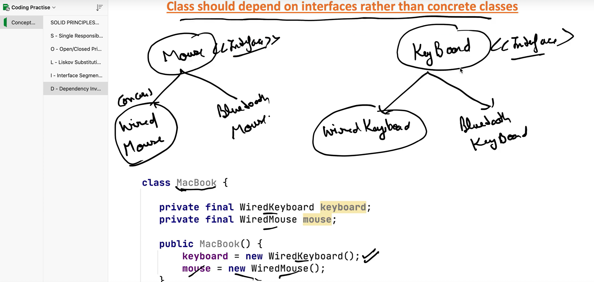
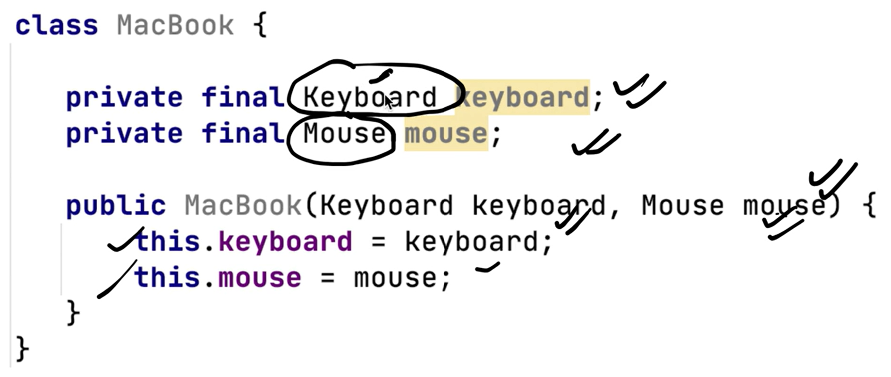

# system-design

    S - Single Responsibility Principle
    O - Open / Closed Principle
    L - Liskov Substitution Principle
    I - Interface Segmented Principle
    D - Dependency Inversion Principle

Advantages of following these principles:

- Avoid duplicate code
- Easy to maintain
- easy to understand
- Flexible software
- Reduce complexity

1. Single Responsibility Principle:
A Class should have only one reason to change. If you see there are three reasons to change 
in the below code. So here it is not following single responsibility principle. Creating separate classes having saveToDb() in InvoiceDao class and print() in InvoicePrinter class makes the classes follow single responsibility principle as shown in second image below. 

2. Open/Closed Principle: It says Open for extension but Closed for modification. So if you see above Dao class we have saveToDB() method, if at all we wanted to save the invoice to file, We need to make the changes in same class. Instead we can create an interface and have multiple child classes which will be implementing that interface as shown below. 

3. Liskov Substitution Principle: Subclass should extend the capability of parent class not narrow it down.
If class B is subtype of class A, then we should be able to replace object of A with B without braking the behaviour of the program.
eg: If you have MotorCycle class which is implementing Bike interface and implementing turnOnEngine() and accelerate() methods. 
    Don't Make Cycle to implement Bike interface which will narrow down the  Bike capability as cycle will not have accelerate.

4. Interface Segmented Principle: Interface should be such, that client should not implement unnecessary functions they do not need.
    Create mall small interfaces for each of the work type instead of creating the big interface having all the methods.

5. Dependency Inversion Principle: Class should depend on interface rather than concrete class. In the below image rather than declaring WiredMouse and WiredKeyboard classes im MacBook class use their interface, as shown in the below image 2

Behavioral Design Patterns:
https://notebook.zohopublic.in/public/notes/bietvc07e6ecf28d7409286145c16e623f9ed

Structural Design Patterns:
https://notebook.zohopublic.in/public/notes/74tdo33c5b7060d544b1c986e519dd3ba4d1b